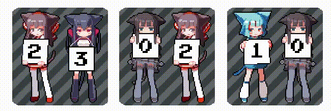

# Booru Clock

A desktop clock with the booru's girls holding digits.

Has the following implementation:
* [Window Gadget](./win7gadget/)
    * static images only
    * gray background only (for now)
    * flip-flopping is optional
* [Rainmeter](./rainmeter/)
    * animated images only
    * gray background only (for now)
    * no flip-flopping
* [Plasmoid (KDE Plasma)](./plasmoid/)
    * 4 girls themes
    * 8 background colors
    * flip-flopping is optional

In all implementations, seconds are optional.  
Opacity in the gadget and rainmeter skin applies to the entire clock.  
In the plasmoid, opacity is split between foreground and background.

Implementations are different due to the platform limitations and being created in very different years.
